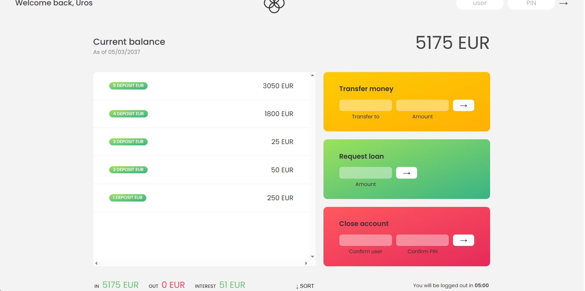
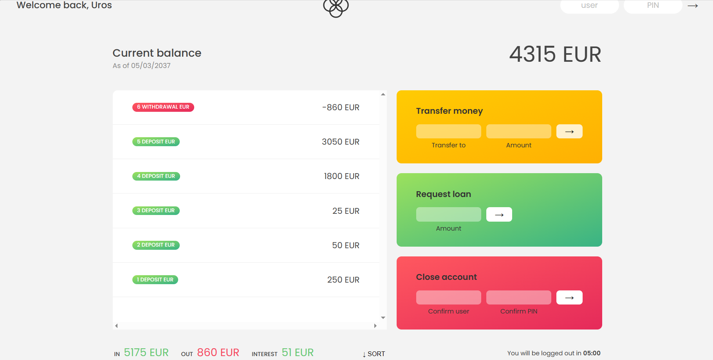

# bankist
Bankist Application

Overview
The Bankist application is a comprehensive banking platform developed using HTML, CSS, and JavaScript. 
It provides users with functionalities to manage their accounts, perform transactions, and interact with other users in a banking environment.

User Registration and Login
Account Information
Users can register and access the application using one of the following pre-existing accounts:

Username: "ul" | Password: "7777"

Username: "js" | Password: "1111"

Username: "jd" | Password: "2222"

Username: "stw" | Password: "3333"

Username: "ss" | Password: "4444"

Account Features

Upon successful login with valid credentials, users gain access to their account dashboard, where they can:

View Transaction History: Users can review their transaction history, displaying both incoming and outgoing transactions.

Transfer Funds: The application allows users to transfer funds between accounts seamlessly.

Request Loans: Users can request loans from other users within the system.

Account Closure: It's possible for users to close their accounts within the application.

Installation and Usage
Installation Steps

Clone Repository: Clone this repository to your local machine using git clone.
Open Application: Open the index.html file in any modern web browser.

User Instructions

Registration: Choose a username and password from the provided account information.
Login: Use the selected credentials to log in and access the account dashboard.
Transaction Review: Check the transaction history to review all past activities within the account.
Perform Actions: Transfer funds, request loans, or close the account through the available functionalities.
View Transactions: All executed transactions are recorded and visible in the transaction history log.
